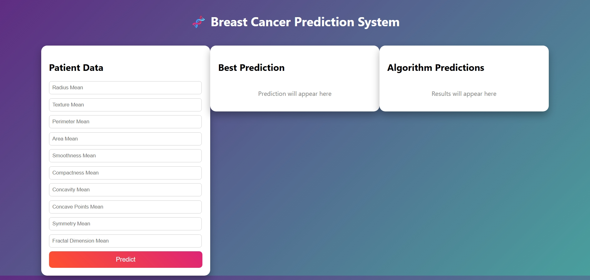
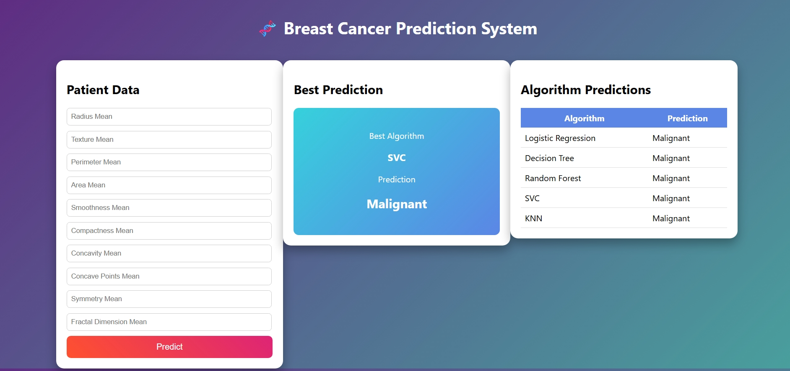

# Breast Cancer Prediction ML Project

A Machine Learning web application that predicts whether a breast tumor is **Malignant** or **Benign** using a trained classification model.

This project is developed using **Python, FastAPI, Scikit-learn, HTML, and CSS**.  
Users can enter tumor feature values in the web interface and receive a prediction instantly.

---

## Project Overview

Breast cancer is one of the most common cancers worldwide.  
Machine Learning can help in early detection by analyzing tumor characteristics.

This project uses a trained classification model to analyze medical features and predict whether the tumor is **Malignant** or **Benign**.

The model is deployed using **FastAPI**, and the user interface is built using **HTML and CSS**.

---

## Technologies Used

- Python  
- FastAPI  
- Scikit-learn  
- HTML  
- CSS  
- Machine Learning  

---

## Project Structure

```
breast-cancer-prediction-ml
│
├── app.py
├── classification_model.pkl
├── requirements.txt
│
├── templates
│   └── index.html
│
├── static
│   └── style.css
│
├── screenshots
│   ├── before_prediction.png
│   └── after_prediction.png
│
└── README.md
```

---

## User Interface

### Before Prediction



### After Prediction



---

## How to Run the Project

### 1 Install Required Libraries

```
pip install -r requirements.txt
```

### 2 Run the FastAPI Server

```
uvicorn app:app --reload
```

### 3 Open the Application

Open your browser and go to:

```
http://127.0.0.1:8000
```

---

## Features

- Machine Learning based breast cancer prediction  
- Simple and clean web interface  
- FastAPI backend for model deployment  
- Real-time prediction results  

---
